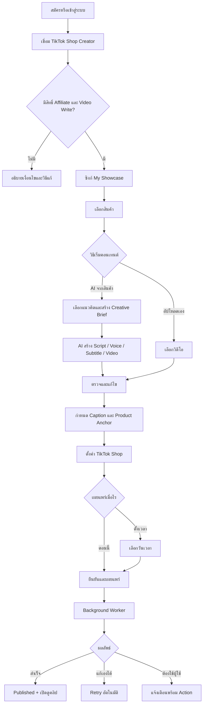

# RelayContent — Product & UX Brief V1

**สถานะ:** พร้อมใช้เริ่มงาน UX/UI  
**วันที่:** 7 กันยายน 2026  
**แพลตฟอร์มหลัก:** Mobile (Android/iOS), รองรับ Responsive Web  
**ตลาดเริ่มต้น:** ประเทศไทย  

---

## 1. Product Definition

RelayContent คือ Mobile Commerce Content Platform สำหรับครีเอเตอร์ TikTok Shop
Affiliate ที่ต้องการสร้าง จัดคิว และเผยแพร่วิดีโอขายสินค้าพร้อมปักตะกร้า

> **เลือกสินค้า สร้างคอนเทนต์ ตั้งเวลา แล้วระบบโพสต์พร้อมตะกร้าให้**

แอปต้องทำให้ผู้ใช้มั่นใจว่างานยังเดินต่อเมื่อปิดแอป และบอกเสมอว่างานอยู่ขั้นไหน
หากเกิดปัญหา แอปต้องอธิบายสิ่งที่เกิดขึ้น สิ่งที่ยังปลอดภัย และสิ่งที่ผู้ใช้ทำต่อได้

### Job to be Done

> เมื่อฉันพบสินค้าที่อยากโปรโมต ฉันต้องการเปลี่ยนข้อมูลสินค้านั้นเป็นวิดีโอขายของ
> พร้อมตะกร้าและตั้งเวลาโพสต์ได้ในที่เดียว เพื่อให้ผลิตคอนเทนต์ได้สม่ำเสมอโดยไม่ต้อง
> สลับหลายแอปหรือเฝ้าระบบจนโพสต์เสร็จ

---

## 2. Primary User

### TikTok Shop Affiliate Creator ในประเทศไทย

- ทำคอนเทนต์คนเดียวหรือมีผู้ช่วยขนาดเล็ก
- ใช้โทรศัพท์เป็นอุปกรณ์หลัก
- มีสินค้าใน TikTok Shop Showcase อยู่แล้ว
- ต้องผลิตหลายคลิปต่อสัปดาห์
- ต้องการลดเวลาคิดสคริปต์ ตัดต่อ ตั้งค่า และโพสต์
- ไม่จำเป็นต้องเข้าใจ API หรือระบบหลังบ้าน

### เป้าหมายของผู้ใช้

- หาและเลือกสินค้าที่น่าทำคอนเทนต์ได้เร็ว
- เปลี่ยนข้อมูลสินค้าเป็นแนวคิดและสคริปต์ที่ใช้ได้จริง
- สร้างหรือเตรียมวิดีโอโดยใช้เวลาน้อยลง
- ปักสินค้าถูกตัวและโพสต์ตรงเวลา
- เห็นทันทีว่างานใดสำเร็จ งานใดต้องแก้

---

## 3. MVP Scope

### อยู่ใน V1

- สมัครและเข้าสู่ระบบ RelayContent
- เชื่อม TikTok Shop Creator หนึ่งบัญชี
- ตรวจสถานะและสิทธิ์ของ Creator
- อ่านสินค้าจาก My Showcase
- ค้นหาและเลือกสินค้า
- ผูกสินค้าได้หนึ่งรายการต่อวิดีโอ
- AI สร้าง Idea, Hook, Script, Shot list, Caption, CTA และ Product Anchor title
- อัปโหลดวิดีโอของผู้ใช้
- AI ช่วย Voice-over, Subtitle และประกอบวิดีโอแบบ Template
- Preview และแก้ไขก่อนอนุมัติ
- ตั้งค่า TikTok และ Commercial Content
- โพสต์ทันทีหรือตั้งเวลา
- ส่ง Shoppable Video พร้อม Product Anchor
- ติดตามสถานะ อัปโหลด ประมวลผล ตั้งเวลา และเผยแพร่
- Retry งานที่ผิดพลาดชั่วคราว
- แจ้งเตือนเมื่อเสร็จ ล้มเหลว หรือต้องเชื่อมบัญชีใหม่
- Content History และ Content Detail
- Light/Dark theme และ Reduced Motion

### ยังไม่อยู่ใน V1

- Shopee และ Shopee Video
- หลาย TikTok Creator ต่อผู้ใช้
- หลายร้านหรือหลาย Workspace
- Team role และ approval หลายชั้น
- Auto-approve และโพสต์โดยไม่ผ่านมนุษย์
- Product Marketplace เต็มรูปแบบ
- Full AI video generation เป็น flow บังคับ
- Advanced commerce analytics, GMV และ commission dashboard
- Instagram, Facebook และ YouTube publishing

---

## 4. Product Principles

1. **Commerce-first** — ทุกคอนเทนต์ต้องเห็นว่าส่งเสริมสินค้าใด
2. **Status-first** — หน้าแรกตอบว่าอะไรต้องทำและงานอยู่ขั้นไหน
3. **Human approval** — AI เตรียมงาน ผู้ใช้ตรวจและอนุมัติก่อนเผยแพร่
4. **Safe to leave** — ผู้ใช้ปิดแอปได้ระหว่างอัปโหลด สร้าง และรอโพสต์
5. **Actionable errors** — ทุกปัญหาต้องมีทางแก้ที่กดทำต่อได้
6. **Product truth** — ราคา โปรโมชัน และคุณสมบัติต้องมาจากข้อมูลสินค้าจริง
7. **Progressive complexity** — แสดงตัวเลือกจำเป็นก่อน แล้วเปิดรายละเอียดเมื่อผู้ใช้ต้องใช้
8. **Mobile-native** — ใช้มือเดียวได้ ปุ่มหลักอยู่ใน thumb zone และรองรับ keyboard/safe area

---

## 5. Information Architecture

### Bottom Navigation

| ตำแหน่ง | เมนู | หน้าที่ |
|---|---|---|
| 1 | หน้าหลัก | งานที่ต้องทำ งานกำลังทำ ตารางโพสต์ และผลล่าสุด |
| 2 | สินค้า | My Showcase, ค้นหา และเลือกสินค้าสร้างคอนเทนต์ |
| 3 | สร้าง | Primary action อยู่กลาง navigation |
| 4 | คอนเทนต์ | Draft, Review, Scheduled, Published และ Failed |
| 5 | โปรไฟล์ | TikTok Shop connection, notification, theme และบัญชี |

การเชื่อมต่อบัญชีอยู่ภายใต้โปรไฟล์ เพราะเป็นงานตั้งค่า ไม่ใช่งานที่ผู้ใช้ทำทุกวัน

---

## 6. End-to-End Journey



---

## 7. Primary Task Flows

### 7.1 First-Time Setup

`Welcome → Register/Login → Connect TikTok Shop → OAuth → Eligibility Check → Sync Showcase → Home`

Success moment แรกคือผู้ใช้เห็นสินค้าใน Showcase ของตนเองภายในแอป

### 7.2 AI-Assisted Shoppable Video

`เลือกสินค้า → สร้างด้วย AI → เลือกเป้าหมาย → เลือก Idea → Generate → Review → Caption & Anchor → TikTok Settings → Schedule → Confirm`

### 7.3 Upload Existing Video

`สร้าง → อัปโหลดวิดีโอ → เลือกสินค้า → Caption & Anchor → TikTok Settings → Schedule/Post Now → Confirm`

### 7.4 Recover Failed Job

`Notification/Home Alert → Content Detail → ดูสาเหตุ → Reconnect/Replace Product/Edit Video → Retry`

---

## 8. Screen Inventory

### A. Entry & Account

| ID | หน้าจอ | จุดประสงค์ |
|---|---|---|
| A01 | Splash / Session Restore | ตรวจ session พร้อมบอกว่ากำลังเตรียมระบบ |
| A02 | Onboarding | อธิบาย Select → Create → Basket → Publish ในไม่เกิน 3 หน้า |
| A03 | Login | Email, password, Google, forgot password |
| A04 | Register | ชื่อ, email, password, terms/privacy |
| A05 | Forgot Password | ส่งลิงก์และแสดง confirmation |

### B. TikTok Shop Connection

| ID | หน้าจอ | จุดประสงค์ |
|---|---|---|
| B01 | Connect TikTok Shop | อธิบายข้อมูลและสิทธิ์ที่ขอ |
| B02 | OAuth In Progress | บอกว่ากำลังไป TikTok และวิธีกลับเข้าแอป |
| B03 | Eligibility Check | ตรวจ Affiliate Creator และ required scopes |
| B04 | Connection Success | แสดง avatar, @username และ sync status |
| B05 | Connection Problem | Expired, missing scope, ineligible และ recovery action |

### C. Home Control Room

| ID | หน้าจอ | จุดประสงค์ |
|---|---|---|
| C01 | Home — New User | นำไปเลือกสินค้าหรือสร้างคลิปแรก |
| C02 | Home — Active | ต้องทำ, กำลังทำ, ตั้งเวลา, โพสต์แล้ว |
| C03 | Home — All Clear | สรุปสถานะปกติและงานถัดไป |
| C04 | Notifications | เหตุการณ์พร้อม deep link ไปแก้หรือเปิดผลลัพธ์ |

### D. Products

| ID | หน้าจอ | จุดประสงค์ |
|---|---|---|
| D01 | My Showcase | Grid/list สินค้าพร้อม search/filter |
| D02 | Product Detail | รูป ราคา commission stock และข้อมูลสำคัญ |
| D03 | Product Unavailable | หมดสต็อก ถูกระงับ หรือหลุดจาก Showcase |
| D04 | Showcase Empty | แนะนำวิธีเพิ่มสินค้าใน TikTok |

### E. Create with AI

| ID | หน้าจอ | จุดประสงค์ |
|---|---|---|
| E01 | Create Source | AI จากสินค้า, อัปโหลดเอง, เริ่มจากไอเดีย |
| E02 | Creative Brief | เป้าหมาย ผู้ชม tone ความยาว และ CTA |
| E03 | Content Ideas | เปรียบเทียบ Idea 3–5 แบบ |
| E04 | Generation Progress | แสดง node progress และอนุญาตให้ออกจากหน้า |
| E05 | Variant Review | เปรียบเทียบผลลัพธ์ A/B |
| E06 | AI Editor | แก้ Hook, Script, Voice, Scene และ Subtitle |

### F. Upload & Edit

| ID | หน้าจอ | จุดประสงค์ |
|---|---|---|
| F01 | Select Video | เลือก MP4/MOV และแสดงข้อจำกัด |
| F02 | Upload Progress | Progress จริง, cancel และ background status |
| F03 | Video Preview | เล่น เปลี่ยน ตัด และตรวจวิดีโอ |
| F04 | Caption & Product | Caption, CTA, selected product และ Anchor title |

### G. Composer & Publish

| ID | หน้าจอ | จุดประสงค์ |
|---|---|---|
| G01 | TikTok Shop Composer | Creator, privacy, interaction และ disclosure |
| G02 | Composer Blocked | แสดง field ที่ต้องแก้และเหตุผล |
| G03 | Post Now or Schedule | เลือกโหมดเผยแพร่ |
| G04 | Date & Time | Date/time, timezone และ suggested times |
| G05 | Review & Confirm | สรุป video, product, anchor, settings และเวลา |
| G06 | Job Accepted | ยืนยันว่าออกจากแอปได้และงานจะทำต่อ |

### H. Content Management

| ID | หน้าจอ | จุดประสงค์ |
|---|---|---|
| H01 | Content Library | Filter ตาม lifecycle พร้อม thumbnail และสินค้า |
| H02 | Draft Detail | ทำต่อ แก้ หรือลบ draft |
| H03 | Processing Detail | Timeline และ progress ของ AI/upload/publish |
| H04 | Scheduled Detail | เวลา สินค้า แก้เวลา หรือยกเลิก |
| H05 | Published Detail | คลิป ตะกร้า permalink และ lifecycle |
| H06 | Failed Detail | สาเหตุ สิ่งที่ยังปลอดภัย และ recovery actions |

### I. Profile & Settings

| ID | หน้าจอ | จุดประสงค์ |
|---|---|---|
| I01 | Profile | ข้อมูลผู้ใช้และสรุปบัญชี TikTok |
| I02 | TikTok Connection | Token, permissions, sync, reconnect/disconnect |
| I03 | Notifications Settings | เลือกเหตุการณ์ที่ต้องแจ้ง |
| I04 | Appearance | System/Light/Dark และ Reduced Motion |
| I05 | Account & Legal | Password, privacy, terms และ sign out |

รวม **45 หน้าจอหลักและ state ที่ต้องออกแบบ**

---

## 9. Global Content Lifecycle

```text
Draft
→ Generating
→ Ready for review
→ Approved
→ Scheduled
→ Uploading
→ Publishing
→ Published
```

เส้นทางแยก:

```text
Generating / Uploading / Publishing
→ Retrying
→ Needs attention
→ Failed
```

ทุกสถานะต้องมี:

- ชื่อภาษาไทยที่เข้าใจง่าย
- เวลาอัปเดตล่าสุด
- สิ่งที่ระบบกำลังทำ
- สิ่งที่ผู้ใช้ทำต่อได้
- thumbnail และสินค้าที่เกี่ยวข้อง

---

## 10. State & Recovery Matrix

| เหตุการณ์ | ระบบทำอะไร | UX ที่ผู้ใช้เห็น | Primary action |
|---|---|---|---|
| Creator ไม่มีสิทธิ์ Affiliate | หยุด onboarding | อธิบายคุณสมบัติที่ต้องมี | เปิดวิธีสมัคร |
| ขาด required scope | หยุดก่อน sync/post | ระบุ permission ที่ขาด | อนุญาตใหม่ |
| Token หมดอายุ | พัก scheduled jobs | ยืนยันว่า draft และเวลายังอยู่ | เชื่อมใหม่ |
| Showcase ว่าง | ไม่เปิด Product Picker | แนะนำการเพิ่มสินค้า | เปิด TikTok |
| สินค้าหมด | หยุดก่อนโพสต์ | แสดงสินค้าที่มีปัญหา | เปลี่ยนสินค้า |
| สินค้าหลุด Showcase | หยุดก่อนโพสต์ | เก็บ video/caption เดิม | เพิ่มกลับ/เปลี่ยน |
| ราคาเปลี่ยน | เปรียบเทียบ snapshot กับค่าปัจจุบัน | แสดงราคาเก่าและใหม่ | อัปเดตคอนเทนต์ |
| AI สร้างล้มเหลว | Retry ตามนโยบาย | แสดง node ที่ล้ม | ลองใหม่ |
| เครดิต AI ไม่พอ | ไม่เริ่มงานเสียค่าใช้จ่าย | แสดงเครดิตที่ต้องใช้ | ซื้อเครดิต |
| Upload หลุด | Resume ถ้าทำได้ | แสดง progress ล่าสุด | ทำต่อ |
| TikTok ปฏิเสธวิดีโอ | เก็บ asset และ settings | แปลเหตุผลเป็นภาษาคน | แก้ไข |
| Publish timeout | Poll สถานะก่อน retry | แจ้งว่ากำลังตรวจเพื่อกันโพสต์ซ้ำ | รอ/ตรวจใหม่ |
| Publish สำเร็จ | บันทึก permalink | Success state | เปิดบน TikTok |

---

## 11. AI UX Contract

### AI ต้องบอกผู้ใช้เสมอ

- กำลังสร้างอะไร
- ใช้ข้อมูลสินค้าเวอร์ชันใด
- ใช้เครดิตเท่าไร
- โดยประมาณต้องรอนานเท่าไร
- ออกจากหน้าได้หรือไม่
- ส่วนใดสร้างด้วย AI
- แก้เฉพาะส่วนใดได้บ้างโดยไม่สร้างทั้งหมดใหม่

### Generation Nodes

```text
วิเคราะห์สินค้า
→ สร้างแนวคิด
→ เขียนสคริปต์
→ สร้างเสียง
→ สร้าง/เลือกฉาก
→ ประกอบวิดีโอ
→ ทำ Subtitle
→ ตรวจคุณภาพ
→ รอผู้ใช้อนุมัติ
```

### Product Truth Rules

- ราคา ส่วนลด สต็อก และ commission มาจากข้อมูลที่ sync เท่านั้น
- แสดงเวลาที่ข้อมูลสินค้าอัปเดตล่าสุด
- AI ห้ามเพิ่มคุณสมบัติหรือคำกล่าวอ้างที่ไม่มีในข้อมูลต้นทาง
- ตรวจข้อมูลใหม่ก่อน publish
- Content ที่มี `source = ai` ต้องติดสถานะ AIGC อัตโนมัติ

---

## 12. Home Dashboard Content Priority

เรียงจากบนลงล่าง:

1. **ต้องทำตอนนี้** — token, product, review หรือ failed job
2. **กำลังทำงาน** — AI generation, upload และ publishing
3. **รอตรวจ** — AI output ที่พร้อม approve
4. **ตั้งเวลาไว้** — คลิปถัดไปเรียงตามเวลา
5. **โพสต์แล้ววันนี้** — ผลลัพธ์ล่าสุด
6. **ภาพรวมสัปดาห์** — จำนวนที่สร้าง ตั้งเวลา และเผยแพร่สำเร็จ

ห้ามทำทุก section เป็นการ์ดสีเทารูปแบบเดียวกัน ต้องใช้ thumbnail, timeline,
progress และ visual density ที่ต่างกันตามหน้าที่

---

## 13. Design Direction

### Concept: Calm Commerce Control Room

แอปต้องดูทันสมัย มั่นใจ และมีชีวิต โดยไม่ทำให้ข้อมูลเชิงปฏิบัติการอ่านยาก

### Visual Language: Content Relay

- สินค้าและ content card เคลื่อนผ่าน node ของ workflow
- เส้นทางสว่างขึ้นตามความคืบหน้า
- งาน active มี pulse เบา ๆ
- เมื่อ schedule การ์ดเคลื่อนเข้าสู่ time slot
- เมื่อ publish สำเร็จเส้นทางปิดครบวงจร
- ใช้ motion สั้นและมีความหมาย

### UI Character

- Thumbnail-first
- Typography ชัดและรองรับภาษาไทย
- Surface มีระดับ แต่ไม่ใช้ card ครอบทุกอย่าง
- สีสถานะใช้เฉพาะจุดสำคัญ
- Primary action อยู่ใน thumb zone
- Touch target อย่างน้อย 48 × 48
- รองรับ 320–430 px และจอกว้าง
- รองรับ Light, Dark, high contrast และ Reduced Motion

---

## 14. Core Components

- AppShell / BottomNavigation
- ContentCard
- ProductCard
- ProductAnchorChip
- CreatorAccountCard
- StatusChip
- WorkflowTimeline
- GenerationNode
- UploadProgressCard
- ScheduleCard
- NotificationCard
- ActionRequiredBanner
- EmptyState
- ErrorRecoveryPanel
- VideoPreview
- StickyPrimaryAction
- FilterChips
- CreditIndicator
- ConfirmationSheet

ทุก component ต้องออกแบบ Loading, Disabled, Error และ Success state ที่เกี่ยวข้อง

---

## 15. Content and Error Copy

ใช้ภาษาไทยตรงไปตรงมาและบอกสิ่งที่ทำต่อได้

| หลีกเลี่ยง | ใช้แบบนี้ |
|---|---|
| Unauthorized | TikTok Shop หลุดการเชื่อมต่อ — เชื่อมใหม่เพื่อให้งานตามเวลาทำต่อ |
| Invalid product | สินค้านี้ปักตะกร้าไม่ได้แล้ว — เลือกสินค้าใหม่โดยวิดีโอและแคปชันยังอยู่ |
| Generation failed | สร้างเสียงไม่สำเร็จ — ลองสร้างเฉพาะเสียงอีกครั้งได้ |
| Upload error | อัปโหลดหยุดที่ 68% — เชื่อมต่ออินเทอร์เน็ตแล้วทำต่อจากจุดเดิม |
| Publishing | กำลังส่งคลิปและตะกร้าไป TikTok — ปิดแอปได้ |
| Success | คลิปพร้อมตะกร้าเผยแพร่แล้ว — เปิดดูบน TikTok |

---

## 16. UX Success Metrics

### North Star

**จำนวน Shoppable Videos ที่เผยแพร่สำเร็จต่อผู้ใช้ต่อสัปดาห์**

### Supporting Metrics

- Time from product selection to scheduled
- First shoppable video completion rate
- AI idea-to-approval rate
- Regeneration rate ต่อ node
- Publish success rate
- Recovery completion rate
- Weekly returning creators
- จำนวนคลิปต่อสินค้า

---

## 17. Technical Feasibility Gate

ก่อนล็อก High-fidelity UX ต้องทดสอบเส้นทางจริงดังนี้:

1. TikTok Shop Partner app ถูกสร้างและตั้งค่าได้
2. Creator authorization สำเร็จ
3. ได้ `creator.showcase.read`
4. ได้ `creator.video.write`
5. อ่าน Creator Profile ได้
6. อ่าน My Showcase ได้
7. อัปโหลดวิดีโอและได้ file ID
8. ส่ง Shoppable Video พร้อม `product_link_info` ได้
9. อ่านผลลัพธ์หรือสถานะหลังเผยแพร่ได้

UX สามารถเริ่มจาก assumption เหล่านี้ได้ แต่ก่อนพัฒนา production ต้องยืนยันทุกข้อ

---

## 18. UX Deliverables

งาน UX รอบแรกต้องส่งมอบ:

- Sitemap และ navigation model
- End-to-end user flow
- Wireframe ครบ 45 screens/states
- Clickable prototype ของ 4 primary flows
- Component inventory
- Empty/loading/error/success state matrix
- Light และ Dark direction
- Usability test script
- Annotation สำหรับ API-dependent fields

### Primary Prototype Scenarios

1. ผู้ใช้ใหม่เชื่อม TikTok และเห็น Showcase
2. เลือกสินค้าแล้วสร้างคอนเทนต์ด้วย AI จนตั้งเวลาเสร็จ
3. อัปโหลดวิดีโอเอง ผูกสินค้า และโพสต์ทันที
4. Token หมดก่อนถึงเวลาโพสต์ แล้วผู้ใช้เชื่อมใหม่และทำงานต่อ

---

## 19. UX Definition of Done

UX พร้อมส่งต่อ UI/Development เมื่อ:

- ผู้ทดสอบเข้าใจภายใน 10 วินาทีว่าแอปช่วยทำอะไร
- ผู้ใช้ใหม่เชื่อมบัญชีและพบสินค้าแรกได้โดยไม่ต้องมีคนสอน
- ผู้ใช้สร้างและตั้งเวลา Shoppable Video แรกได้
- ทุกสถานะ async บอกว่ารออะไรและออกจากหน้าได้หรือไม่
- ทุก failure สำคัญมี recovery path
- ผู้ใช้เห็นสินค้าที่ปักอยู่ก่อนยืนยันเสมอ
- ไม่มีการโพสต์ AI content โดยไม่ผ่าน approval
- Navigation และ primary action ใช้มือเดียวได้
- Flow ผ่านทั้งจอเล็ก keyboard เปิด และข้อความไทยยาว
- Design รองรับข้อมูลจริง ไม่พึ่ง placeholder ที่สั้นผิดธรรมชาติ

---

## 20. Open Decisions After UX Starts

สิ่งเหล่านี้ไม่ขวางงาน wireframe แต่ต้องตอบก่อน development รอบถัดไป:

- Provider และต้นทุนของ Full AI Video
- ข้อมูล commerce analytics ที่ scope จริงเปิดให้ใช้
- วิธีคิดเครดิตและคืนเครดิตเมื่องานล้มเหลว
- Retention ของวิดีโอและ generated assets
- จำนวนครั้ง retry และเวลาหมดอายุของ scheduled job
- Product data fields ที่ Showcase API คืนจริงในตลาดไทย
- TikTok Shop review/audit requirements สำหรับ production app
